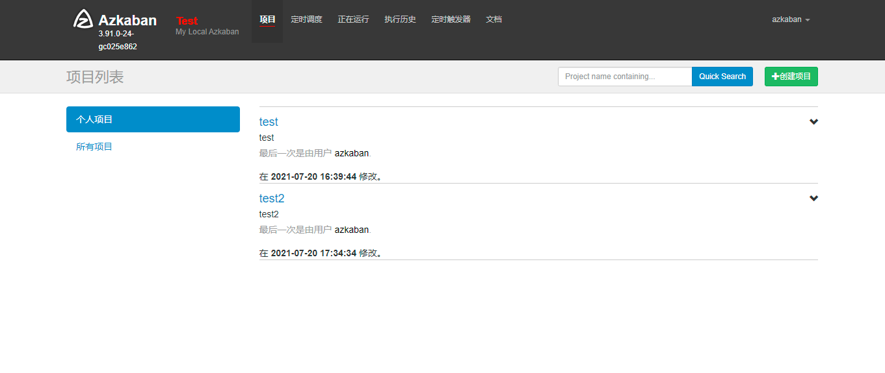
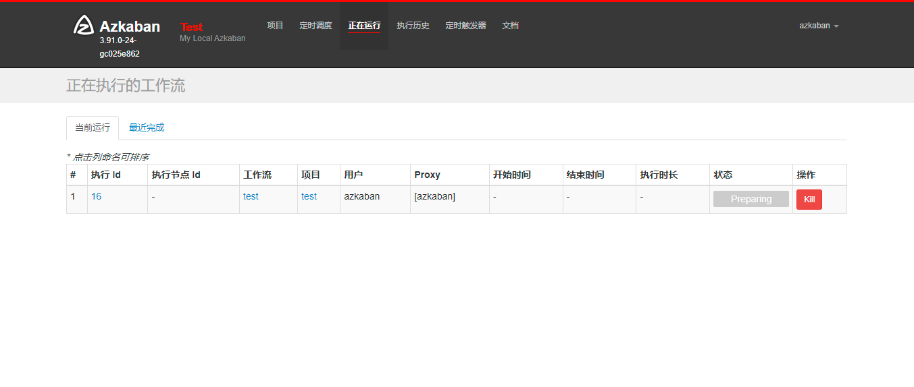
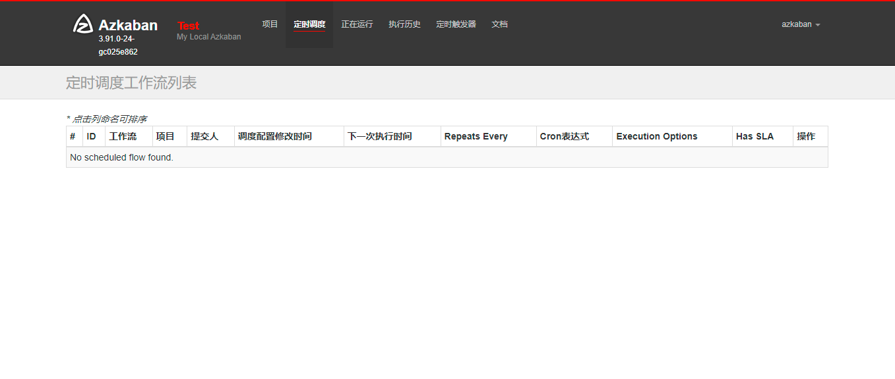
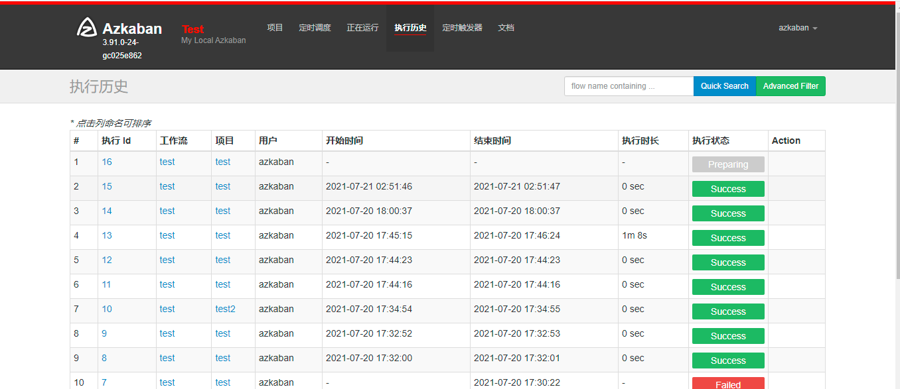
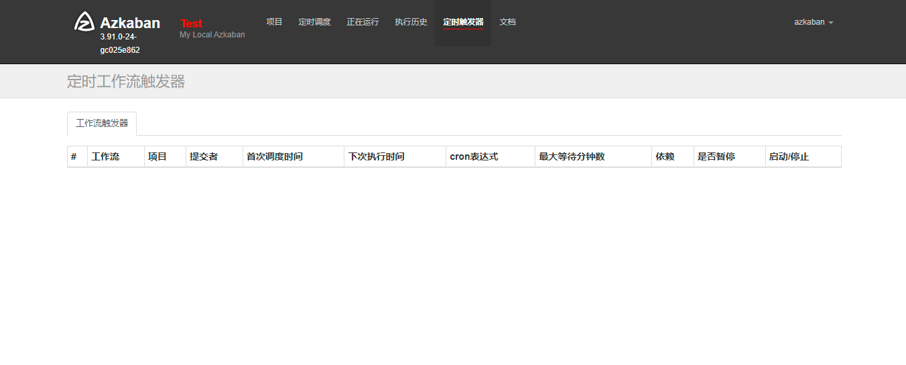
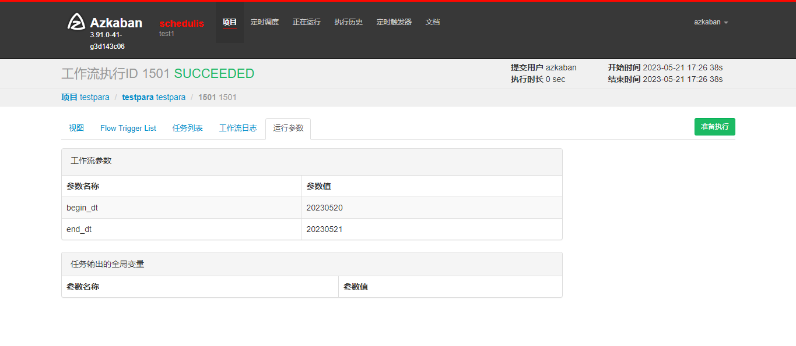

# Azkaban 

# 说明
这是版本 4.0.0的多语言版本（中文、英文），或者说是汉化版本
初衷：国内普遍不太习惯英文版本，但是官方并没有做多语言支持，为便于大家使用，整理了这个版本（参考了Schedulis）
大家一起在这个基础上不断完善，为大家提供一个用着习惯的版本。

最新安装包（目前已完成大部分页面 支持 中文及英文切换，也可以自己打包）下载地址：

链接：https://pan.baidu.com/s/1myKbtBxAgTIbxVcDR-3HdA
提取码：o95n

以下是图片，编译相关问题参考 README.md

项目： [docs/zh_cn/project.png](docs/zh_cn/project.png)

运行中：[docs/zh_cn/running.png](docs/zh_cn/running.png)

定时调度：[docs/zh_cn/schedule.png](docs/zh_cn/schedule.png)

执行历史：[docs/zh_cn/history.png](docs/zh_cn/history.png)

工作流触发器：[docs/zh_cn/flowtrigger.png](docs/zh_cn/flowtrigger.png)

显示工作流执行参数：[docs/zh_cn/exec-para.png](docs/zh_cn/exec-para.png)

项目地址：
github：
https://github.com/zhaoyansheng163/azkaban

最新文档版本的汉化版本（4.0.0）
https://github.com/zhaoyansheng163/azkaban/tree/release4.0.0

gitee：
https://gitee.com/zhaoyansheng/azkaban

最新文档版本的汉化版本（4.0.0）
https://gitee.com/zhaoyansheng/azkaban/tree/release4.0.0/

如何打包汉化版本：

git clone https://gitee.com/zhaoyansheng/azkaban.git

git checkout   release4.0.0

./gradlew build -x test

如果有问题则
# 停止正在运行的Gradle守护进程
./gradlew --stop

# 清理项目构建
./gradlew clean

# 清理Gradle的依赖缓存 （注意：这会清理所有项目的缓存，稍显耗时）
rm -rf ~/.gradle/caches/

# 重新构建并刷新依赖
./gradlew build --refresh-dependencies -x test

其他操作步骤参考英文版的文档即可。其实差异就是切换到 汉化分支：release4.0.0

build
# Build Azkaban
./gradlew build

# Clean the build
./gradlew clean

# Build and install distributions
./gradlew installDist

# Run tests
./gradlew test

# Build without running tests
./gradlew build -x test

运行
Installing the Solo Server
Follow these steps to get started:

1. Clone the repo:

git clone https://github.com/azkaban/azkaban.git
2. Build Azkaban and create an installation package:

cd azkaban; ./gradlew build installDist
3. Start the solo server:

cd azkaban-solo-server/build/install/azkaban-solo-server; bin/start-solo.sh
Azkaban solo server should be all set, by listening to 8081 port at default to accept incoming network request. So, open a web browser and check out http://localhost:8081/ . The default login username and password for the solo server are both azkaban which is configured in conf/azkaban-users.xml in the resources folder of the solo server.

4. Stop server:

bin/shutdown-solo.sh

参考了如下项目：
https://gitee.com/WeBank/Schedulis

本地启动调试说明：

关键词：
azkaban 汉化
azkaban 中文
azkaban 汉语